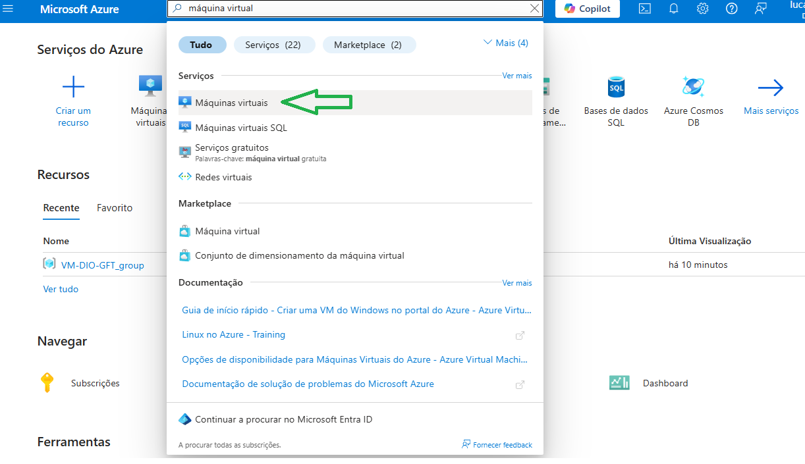
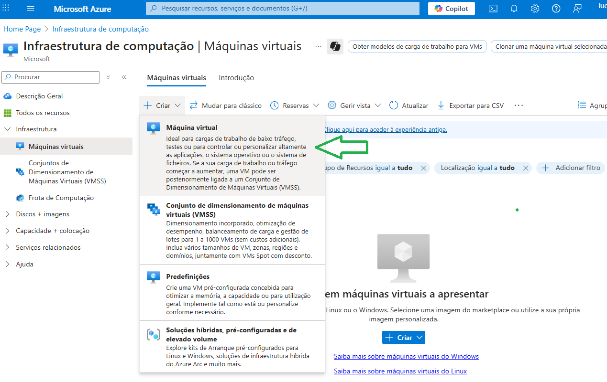
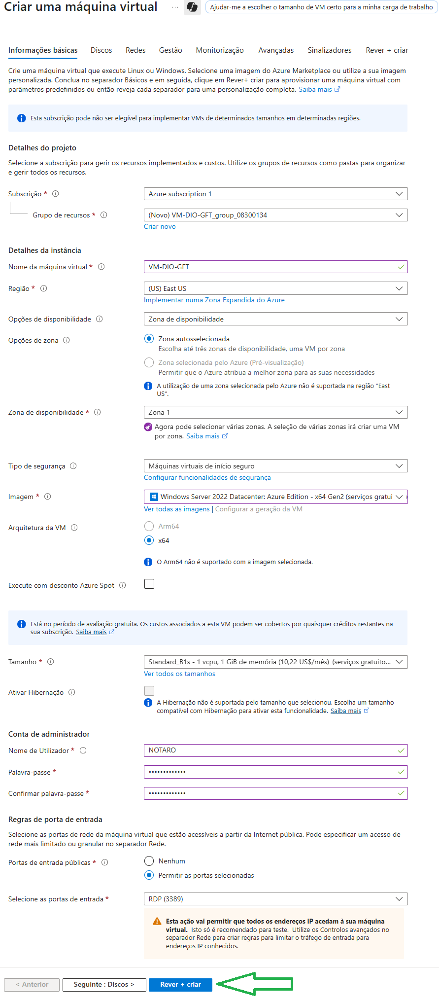
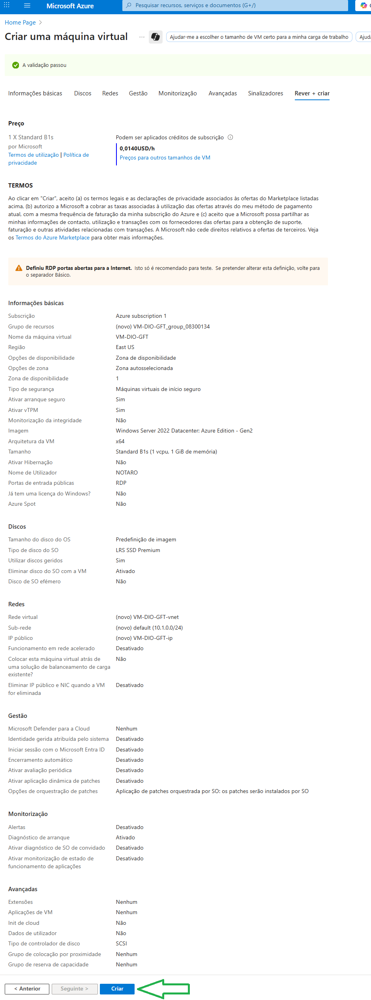
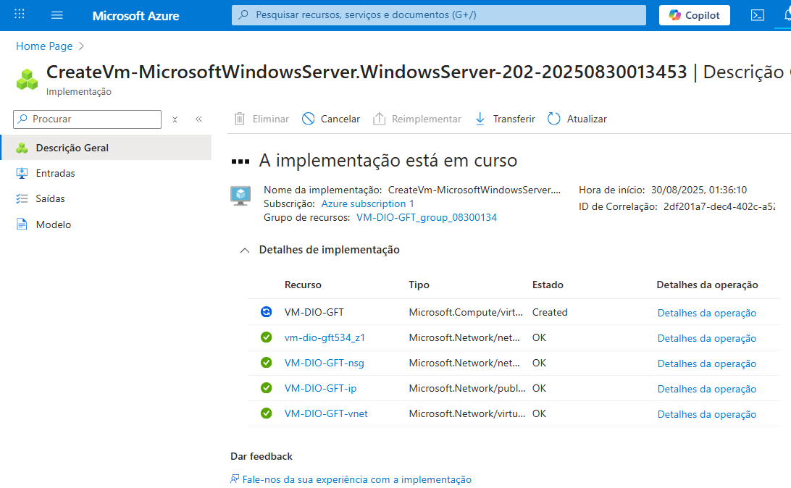

Este documento descreve o passo a passo que realizei para criar uma máquina virtual no Azure.

Primeiramente, será necessário entrar no portal Azure e realizar o login. Caso não tenha, pode criar uma conta gratuita em:  
https://azure.microsoft.com/free/

---

### Na barra de busca localizada na parte superior central, digite 'máquina virtual' e clique em “máquinas virtuais”.

---

### Ao acessar a área de criação da máquina, aparecerá a tela abaixo com a opção 'Criar'. Expanda o campo e clique em “Máquina Virtual”.

---

### Nesta etapa, será necessário definir suas configurações. Essas definições vão desde ajustes básicos, como região e modelo, até opções avançadas.  
Ao clicar em 'Revisar e criar', localizado na parte inferior da tela, a máquina será criada e uma tela de confirmação será exibida.

---

### Nesta etapa, após revisar as informações, clique em "Criar".

---

Após estas etapas, a máquina virtual já foi criada.

